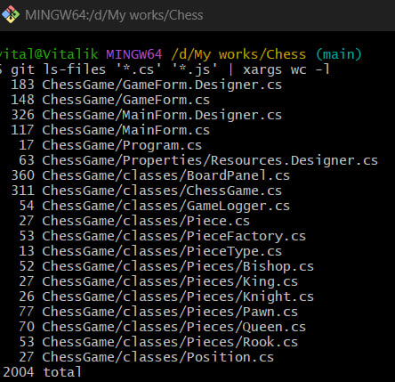
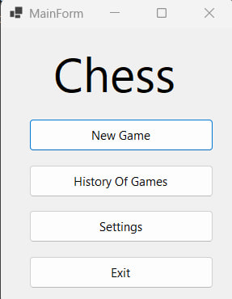
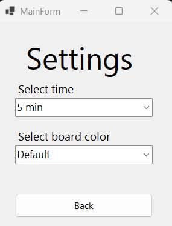
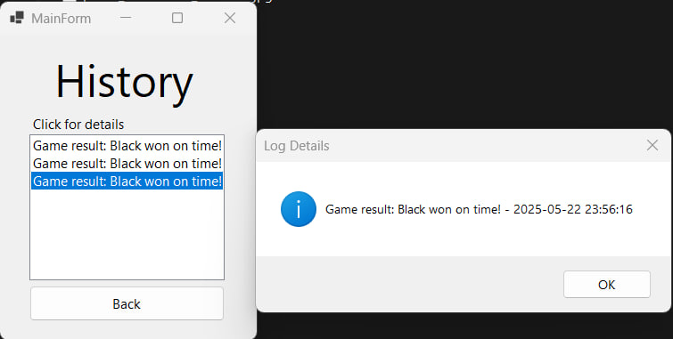
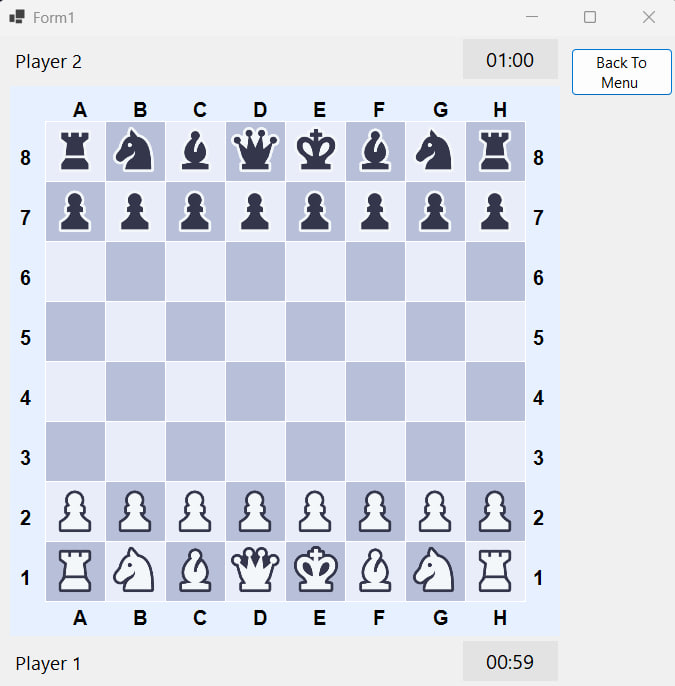
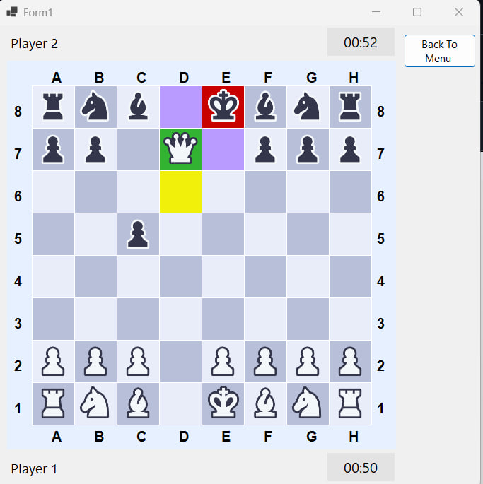

# ♟️ChessGame
ChessGame — це настільна гра «Шахи», реалізована на C# з використанням Windows Forms. Гравці можуть грати за білих або чорних, робити ходи фігурами, бачити підсвітку доступних ходів і останнього ходу, а також обирати теми оформлення дошки. Гра підтримує базові шахові механіки, такі як перевірка шаху, мату та патової ситуації, із таймерами для кожного гравця.

# 🌟Особливості
- Базові шахові механіки: Переміщення фігур, перевірка шаху, мату та патової ситуації.

- Таймери: Налаштування часу гри (1, 5 або 10 хвилин на гравця).

- Теми оформлення: Вибір стилів дошки (класична, синя, зелена).

- Інтерактивний інтерфейс:

  - Підсвітка доступних ходів (фіолетовий для порожніх клітинок, зелений для захоплення).

  - Підсвітка останнього ходу (жовтий) та короля в шаху (червоний).

- Історія ігор: Перегляд попередніх партій.

# 🔢Рядки коду

- Кількість рядків в коді
  


# 📷Скріншоти
  - Головне меню
    
  
  
  - Меню налаштування
    
  
  
  - Меню історії ігор
    
  
  - Ігрова дошка
    
  
  
  - Активність на ігровій дошці

  

# 📋Вимоги
- .NET Framework 4.7.2 або новіший
- Visual Studio 2019 або новіший (для розробки)

# 🔧Встановлення
1. Клонуйте репозиторій:
   ```
   git clone https://github.com/VitalikNeznayko/Chess.git
   ```
3. Відкрийте рішення (`ChessGame.sln`) у Visual Studio.
4. Зберіть і запустіть проєкт.

# 🎮 Використання
1. **Запустіть гру**:
   - Відкрийте додаток і з головного меню натисніть "Почати гру" або "Налаштування".
2. **Налаштуйте гру**:
   - Виберіть час на партію (1, 5 або 10 хвилин) і тему дошки (класична, синя, зелена) у меню налаштувань.
3. **Грайте**:
   - Клікніть на свою фігуру, щоб вибрати її (доступно лише для фігур поточного гравця: білі або чорні).
   - Клікніть на клітинку призначення:
     - 🟣 **Фіолетова підсвітка**: Хід на порожню клітинку.
     - 🟢 **Зелена підсвітка**: Захоплення ворожої фігури.
     - 🔴 **Червона підсвітка**: Ваш король у шаху.
   - Жовта підсвітка показує останній хід.
4. **Слідкуйте за грою**:
   - Таймери у верхній частині екрана показують залишок часу для кожного гравця.
   - Гра автоматично виявляє шах, мат, пат або закінчення часу.
5. **Завершення гри**:
   - Після мату, пату чи закінчення часу з’явиться повідомлення про результат.
   - Виберіть «Грати знову», щоб почати нову партію, або натисніть «Back to Menu», щоб повернутися до головного меню.

# 🤝Контриб’ютинг
Ваші внески вітаються! Щоб долучитися:
1. Форкніть репозиторій.
2. Створіть гілку для нової функції (`git checkout -b your-feature`).
3. Зафіксуйте зміни (`git commit -m "Add your feature"`).
4. Надішліть гілку (`git push origin your-feature`).
5. Створіть Pull Request.
Будь ласка, дотримуйтесь стилю коду, якщо це можливо.
